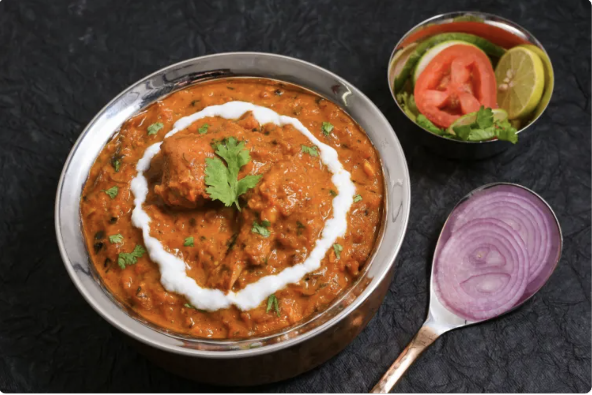
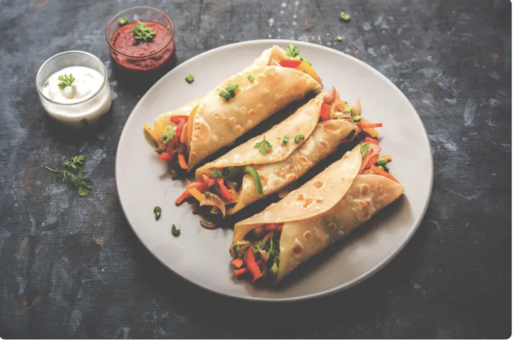
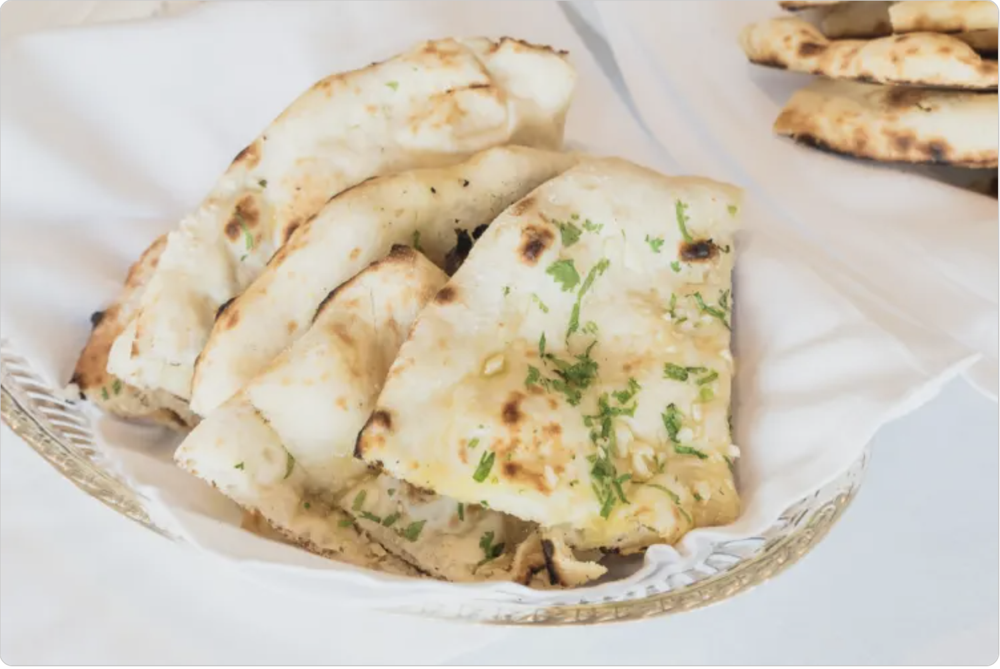
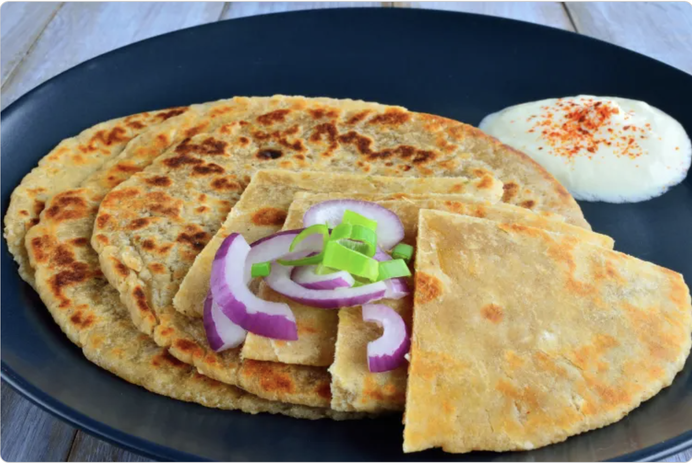
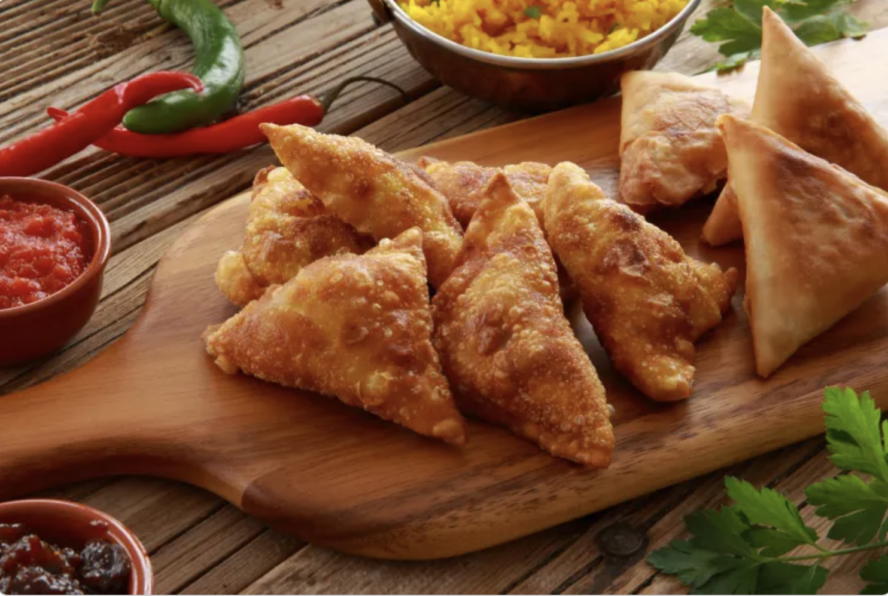
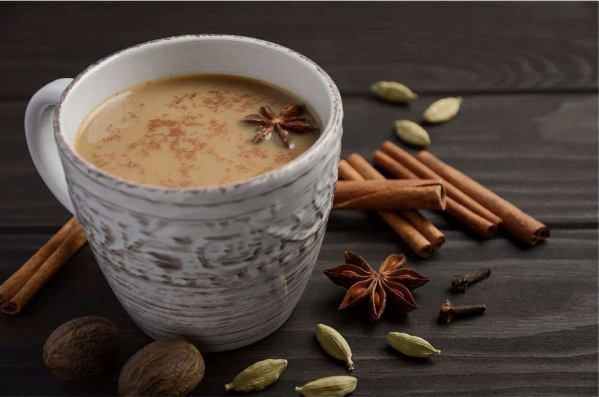

## Menu

[First Food Section](#first-food-section) | ... | [Beverages](#beverages)

## Indian Food
| Name       | Description                 |                        | Price  |
|:-----------|:----------------------------|------------------------|-------:|
| Butter Chicken    | Butter Chicken is a creamy, mildly spiced North Indian dish with tender chicken in a rich tomato-based sauce. || 300 ฿|        
| Kathi Rolls| Kathi Rolls are Indian street food featuring spiced meat or vegetables wrapped in a paratha. They are flavorful and portable.|| 150 ฿|
| Naan| Naan is a soft, leavened Indian flatbread, typically cooked in a tandoor. It pairs well with curries and stews and can be plain or flavored with ingredients like garlic or cheese.|| 100 ฿|
|Paratha|Paratha is a popular Indian flatbread made from whole wheat flour. It is known for its flaky, layered texture and can be either plain or stuffed with various fillings.|| 100 ฿|
|Samosas| Samosas are a popular Indian snack consisting of a crispy pastry shell filled with spiced ingredients. They are typically triangular or cone-shaped and can be served as an appetizer or snack.|| 100 ฿

## Beverages

|Name | Description |               |Price|
|:----|:-------------|--------------|-----:|
| Masala Chai |Masala Chai is a spiced Indian tea made with black tea, milk, sugar, and spices like cardamom and ginger.|| 90฿|

