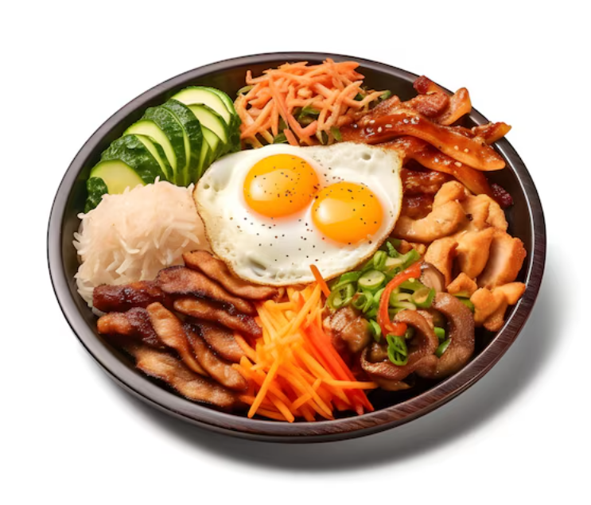
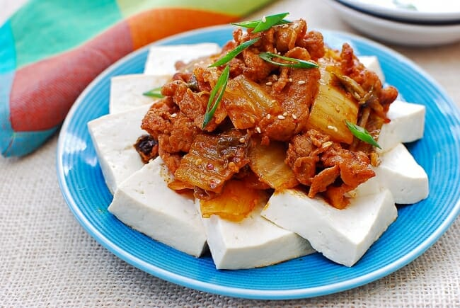
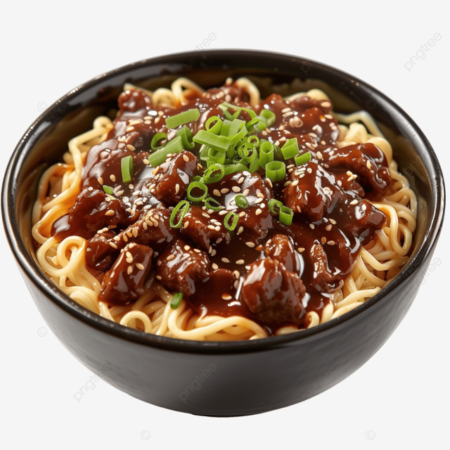
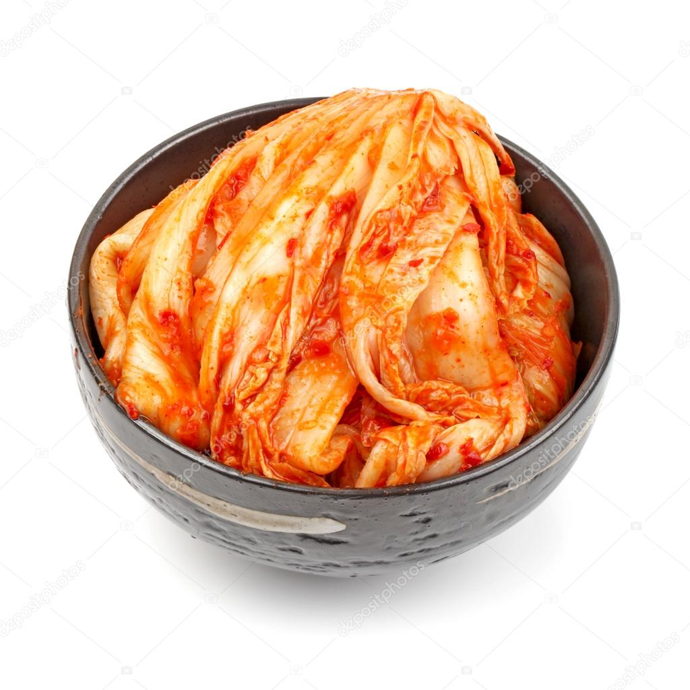
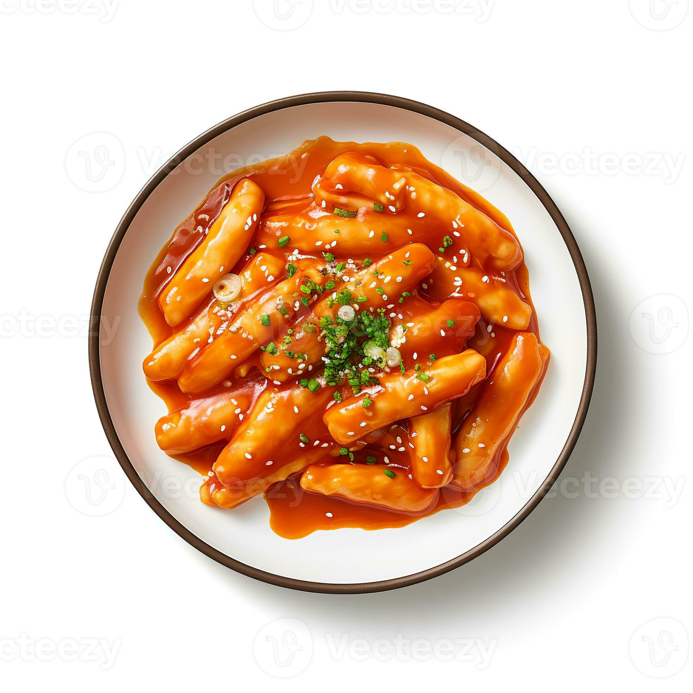
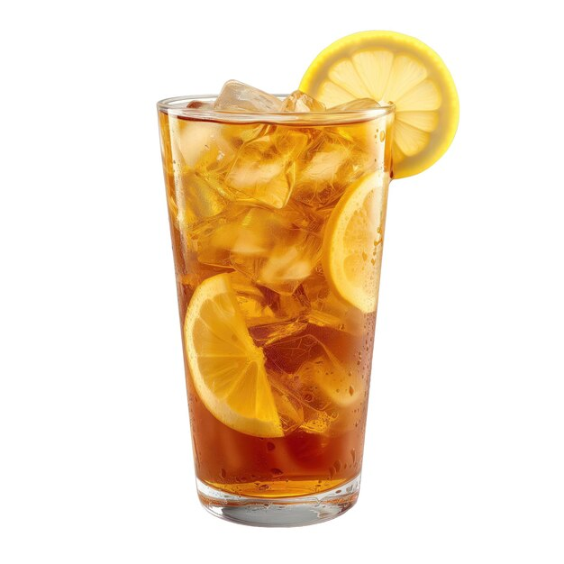

## Menu

[Korean Food Section](#korean-food-section) | ... | [Beverages](#beverages)

## Korean Food Section
| Dish         | Description                                                                                                                                                                                                                                    | Image                                         | Price |
|:-------------|------------------------------------------------------------------------------------------------------------------------------------------------------------------------------------------------------------------------------------------------|-----------------------------------------------|-------|
| Bibimbap     | This Korean lunch-in-a-bowl mixes together a simple salad of rice, mixed vegetables, rice, beef, and egg, with sesame oil and a dollop of chili paste for seasoning.                                                                           |     | 129   |
| Dubu kimchi  | This appropriate combination of blanched dubu (tofu), sauteed kimchi, and stir-fried pork is a threesome made in heaven. The dubu, which has the potential to be bland on its own, has the pork to add substance and the kimchi to add flavor. |    | 99    |
| Jjajangmyeon | Although originally a Chinese dish, Koreans have taken the noodles and created a thicker, sweeter version that holds only a vague resemblance to its Chinese predecessor.                                                                      |  | 109   |
| Kimchi       | Kimchi is the beloved spicy sidekick at every Korean table. It’s made by salting and preserving fermented cabbage in a bed of red chilli pepper, garlic, ginger, and scallion.                                                                 |        | 59    |
| Tteokbokki   | This iconic red-orange street food is so popular there’s an entire part of Seoul just devoted to the steamed and sliced rice cakes, cooked with fish cakes and scallions in a sweet and spicy sauce made of chili paste.                       |    | 89    |

## Beverages
| Beverages | Description                                                                  | Image                                     | Price |
|:----------|------------------------------------------------------------------------------|-------------------------------------------|-------|
| Lemon Tea | Refreshing a perfect blend of sweet and sour. Great for hot days or any day. |  | 39    |
