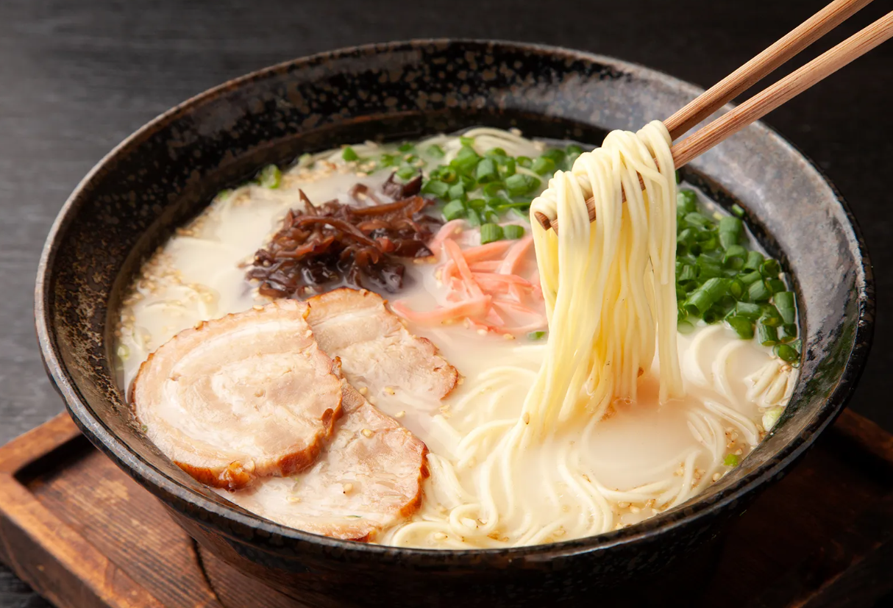
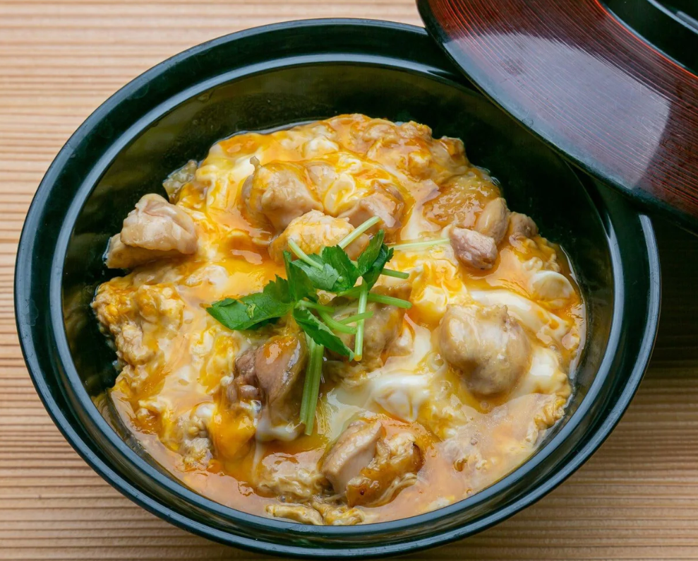
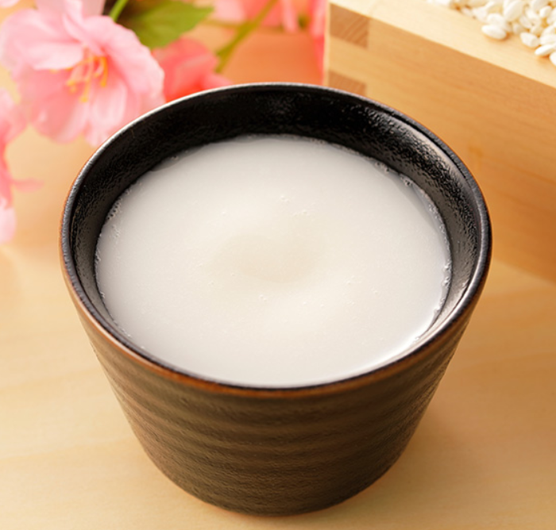

## Menu

[Japanese Food](#japanese-food) | ... | [Beverages](#beverages)

## Japanese Food

| Dish     | Description                        |                                                                           | Price |
|:---------|:-----------------------------------|---------------------------------------------------------------------------|------:|
| Ramen    | The Japanese noodles               |        |  150฿ |  
| Oyakodon | Rice with chicken, eggs and onions |  |  115฿ |  
| Takoyaki | Octopus dumplings                  |  |   69฿ |  
| Omurice  | The rice omelet                    |    |  100฿ |  
| Gyosa    | The Japanese ravioli               |        |   69฿ |  

<head> 
 <icon >
</head>

## Beverages

| Beverages | Description                          |                                                                         | Price |
|:----------|:-------------------------------------|-------------------------------------------------------------------------|------:|
| Amazake   | Sweet drink made with fermented rice |  |  199฿ | 