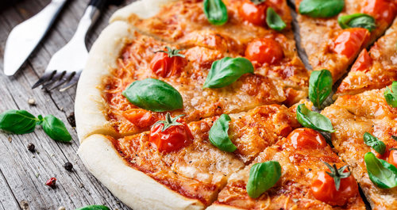
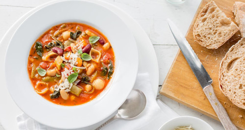

## Menu

[Italian Food](#first-food-section) | ... | [Beverages](#beverages)

## Italian Food

| Dish            | Description                                                                                                                                                    | Images                                           | Price (฿) | 
|:----------------|----------------------------------------------------------------------------------------------------------------------------------------------------------------|--------------------------------------------------|-----------|
| Tortellini      | A traditional Italian pasta filled with a mixture of meat, cheese, or vegetables, often served in broth or with a savory sauce.                                |       | 250  ฿    |
| Risotto         | A creamy, slow-cooked Italian rice dish, typically prepared with broth, onions, garlic, and a variety of ingredients like mushrooms, seafood, or saffron.      |          | 300    ฿  |
| Pizza           | An iconic Italian dish featuring a thin, crispy crust topped with tomato sauce, mozzarella cheese, and various toppings like pepperoni, vegetables, and herbs. |            | 400   ฿   |
| Lasagna         | A hearty Italian casserole made with layers of flat pasta, rich meat sauce, creamy béchamel, and melted cheese, baked to perfection.                           |          | 350   ฿   |
| Minestrone Soup | A wholesome Italian vegetable soup, often made with seasonal vegetables, beans, pasta, and a light tomato-based broth.                                         |  | 180   ฿   |

## Beverages
| Dish     | Description                                                                                                                                                                  | Images                                    | Price (฿)  | 
|:---------|------------------------------------------------------------------------------------------------------------------------------------------------------------------------------|-------------------------------------------|------------|
| Espresso | A strong, concentrated coffee brewed by forcing hot water through finely-ground coffee beans, typically served in small shots and known for its rich flavor and smooth crema |  | 80   ฿     |

> Result should be in alphabetical order by beverage name.

 