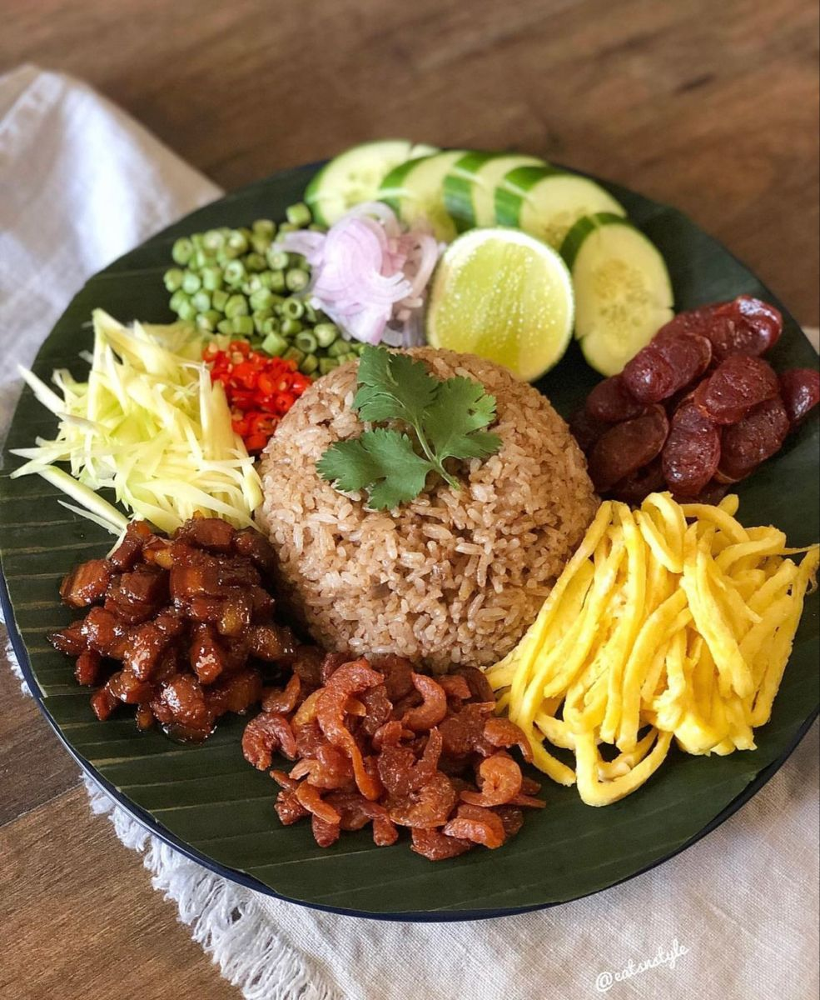

## Menu

[Thai Food](#thai-food) | ... | [Beverages](#beverages)

## Thai Food
| Name                            | Description                                                                                |                                                                                     | Price |
|:--------------------------------|:-------------------------------------------------------------------------------------------|-------------------------------------------------------------------------------------|------:|
| Khao Khluk Kapi                 | Shrimp paste fried rice with sweet pork, dried shrimp, green mango, and lime.              |  |   59฿ |
| Khao Soi                        | Northern Thai coconut curry with egg noodles, chicken or beef, topped with crispy noodles. |               |   69฿ |
| Miang Kham                      | Snack of roasted coconut, peanuts, and herbs wrapped in betel leaves.                      |           |   39฿ |
| Sai Oua (Northern Thai Sausage) | Spicy, aromatic grilled pork sausage with lemongrass and affirm lime leaves.               |                 |   69฿ |
| Som Tum (Green Papaya Salad)    | Spicy and tangy salad made from shredded green papaya, with peanuts, lime, and chilies.    |                 |   59฿ |

## Beverages
| Name                    | Description                                                                  |                                                                      | Price |
|:------------------------|:-----------------------------------------------------------------------------|----------------------------------------------------------------------|------:|
| Thai Iced Tea (Cha Yen) | Sweet black tea with condensed milk, served over ice. Refreshing and creamy. |  |   45฿ |
