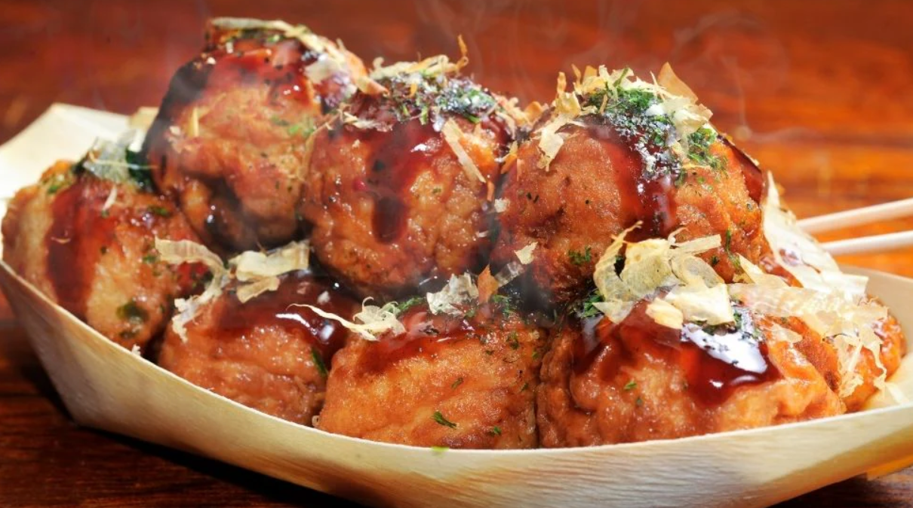

## Menu

[Italian Food](#italian-food)| [Japanese Food](#japanese-food)| [Korean Food Section](#korean-food-section) | [Thai Food](#thai-food) | [Beverages](#beverages)

## Italian Food

| Dish            | Description                                                                                                                                                    | Images                                           | Price (฿) | 
|:----------------|----------------------------------------------------------------------------------------------------------------------------------------------------------------|--------------------------------------------------|-----------|
| Tortellini      | A traditional Italian pasta filled with a mixture of meat, cheese, or vegetables, often served in broth or with a savory sauce.                                |       | 250   ฿   |
| Risotto         | A creamy, slow-cooked Italian rice dish, typically prepared with broth, onions, garlic, and a variety of ingredients like mushrooms, seafood, or saffron.      |          | 300   ฿   |
| Pizza           | An iconic Italian dish featuring a thin, crispy crust topped with tomato sauce, mozzarella cheese, and various toppings like pepperoni, vegetables, and herbs. |            | 400   ฿   |
| Lasagna         | A hearty Italian casserole made with layers of flat pasta, rich meat sauce, creamy béchamel, and melted cheese, baked to perfection.                           |          | 350   ฿   |
| Minestrone Soup | A wholesome Italian vegetable soup, often made with seasonal vegetables, beans, pasta, and a light tomato-based broth.                                         |  | 180   ฿   |

## Japanese Food

| Dish     | Description                        |                                                                           | Price(฿) |
|:---------|:-----------------------------------|---------------------------------------------------------------------------|------:|
| Ramen    | The Japanese noodles               |        |  150฿ |  
| Oyakodon | Rice with chicken, eggs and onions |  |  115฿ |  
| Takoyaki | Octopus dumplings                  |  |   69฿ |  
| Omurice  | The rice omelet                    |    |  100฿ |  
| Gyosa    | The Japanese ravioli               |        |   69฿ |  

## Korean Food
| Dish         | Description                                                                                                                                                                                                                                    | Image                                         | Price |
|:-------------|------------------------------------------------------------------------------------------------------------------------------------------------------------------------------------------------------------------------------------------------|-----------------------------------------------|-------|
| Bibimbap     | This Korean lunch-in-a-bowl mixes together a simple salad of rice, mixed vegetables, rice, beef, and egg, with sesame oil and a dollop of chili paste for seasoning.                                                                           |     | 129   |
| Dubu kimchi  | This appropriate combination of blanched dubu (tofu), sauteed kimchi, and stir-fried pork is a threesome made in heaven. The dubu, which has the potential to be bland on its own, has the pork to add substance and the kimchi to add flavor. |    | 99    |
| Jjajangmyeon | Although originally a Chinese dish, Koreans have taken the noodles and created a thicker, sweeter version that holds only a vague resemblance to its Chinese predecessor.                                                                      |  | 109   |
| Kimchi       | Kimchi is the beloved spicy sidekick at every Korean table. It’s made by salting and preserving fermented cabbage in a bed of red chilli pepper, garlic, ginger, and scallion.                                                                 |        | 59    |
| Tteokbokki   | This iconic red-orange street food is so popular there’s an entire part of Seoul just devoted to the steamed and sliced rice cakes, cooked with fish cakes and scallions in a sweet and spicy sauce made of chili paste.                       |    | 89    |

## Thai Food
| Name                            | Description                                                                                |                                                                                     | Price(฿) |
|:--------------------------------|:-------------------------------------------------------------------------------------------|-------------------------------------------------------------------------------------|------:|
| Khao Khluk Kapi                 | Shrimp paste fried rice with sweet pork, dried shrimp, green mango, and lime.              |  |   59฿ |
| Khao Soi                        | Northern Thai coconut curry with egg noodles, chicken or beef, topped with crispy noodles. |               |   69฿ |
| Miang Kham                      | Snack of roasted coconut, peanuts, and herbs wrapped in betel leaves.                      |           |   39฿ |
| Sai Oua (Northern Thai Sausage) | Spicy, aromatic grilled pork sausage with lemongrass and affirm lime leaves.               |                 |   69฿ |
| Som Tum (Green Papaya Salad)    | Spicy and tangy salad made from shredded green papaya, with peanuts, lime, and chilies.    |                 |   59฿ |

## Beverages
| Name                    | Description                                                                  |                                                                      | Price(฿) |
|:------------------------|:-----------------------------------------------------------------------------|----------------------------------------------------------------------|------:|
| Amazake   | Sweet drink made with fermented rice |  |  199฿ | 
| Espresso | A strong, concentrated coffee brewed by forcing hot water through finely-ground coffee beans, typically served in small shots and known for its rich flavor and smooth crema |  | 80   ฿     |
| Lemon Tea | Refreshing a perfect blend of sweet and sour. Great for hot days or any day. |  | 39    |
| Thai Iced Tea (Cha Yen) | Sweet black tea with condensed milk, served over ice. Refreshing and creamy. |  |   45฿ |
